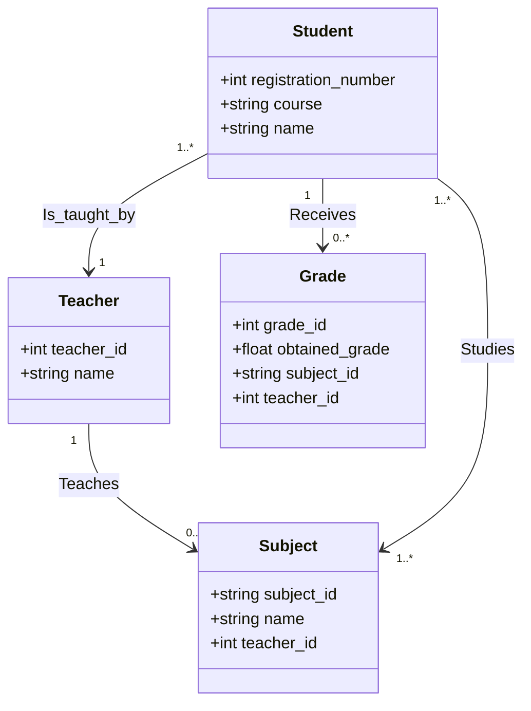
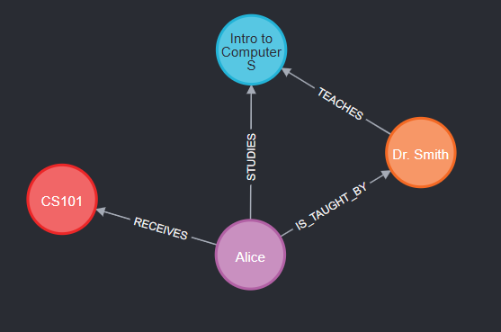

# S202-grade-manager
Repository dedicated to storing the S202 - Database II project where a grading system is made using a non-relational database.

## Class Diagram


## Usage
1. Install the requirements:
```bash
pip install -r requirements.txt
```
2. (OPTIONAL) If you will develop, install the CI requirements:
```bash
pip install -r requirements-dev.txt
```
3. Create a `.env` file running the following script:
  - UNIX/Mac
  ```bash
  ./scripts/create_env.sh
  ```
  - Windows
  ```bash
  ./scripts/create_env.bat
  ```
4. Edit the `.env` file with your neo4j sandbox credentials, provided when you create an account or new project.
5. Run the project
```bash
python3 main.py
```
In the Neo4j Sandbox you can see the data and relationships created by the program:


## Code Quality
### Linter
A linter that checks for syntax errors, potential bugs, and style violations.\
The project uses [flake8](https://flake8.pycqa.org/en/latest/) as linter. To run the linter all code, execute the following command:
```bash
flake8 .
```
If the linter find a problem, it will show a message with the error.
```bash
./src/example.py:13:3: E303 too many blank lines (2)
./src/example.py:20:1: W391 blank line at end of file
```
Fixing the error manually and when finish, flake8 will not show any message.

### Formatter
The project uses [black](https://black.readthedocs.io/en/stable/) as formatter. To run the formatter in all code, execute the following command:
```bash
black .
```

### Sorting Imports
The project uses [isort](https://pycqa.github.io/isort/) as sorting imports. To run the sorting imports in all code, execute the following command:
```bash
isort .
```
