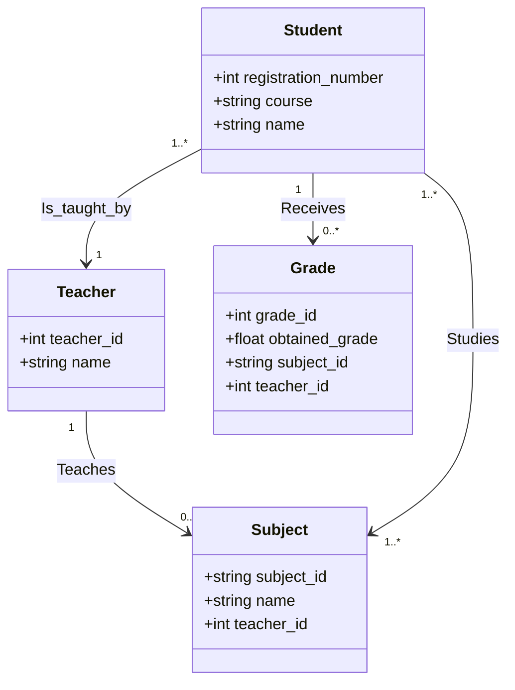

# S202-grade-manager
Repository dedicated to storing the S202 - Database II project where a grading system is made using a non-relational database.

## Index

### [1. Class Diagram](#class-diagram)
- [Class Relationships](#class-diagram)  

### [2. Usage](#usage)
- [Install the requirements](#install-the-requirements)
- [Create a env file](#create-a-env-file)
- [Run the project](#run-the-project)  

### [3. Code Quality](#code-quality)
- [Linter](#linter)  
- [Formatter](#formatter)  
- [Sorting Imports](#sorting-imports)  

### [4. Contributors](#contributors)
- [Matheus Fonseca](#matheus-fonseca)  
- [Pedro Luis Dionísio Fraga](#pedro-luis-dionísio-fraga)  


## Class Diagram


## Usage

### Install the requirements

Install the requirements:

```bash
pip install -r requirements.txt
```

> (OPTIONAL) If you will develop, install the CI requirements:
> ```bash
> pip install -r ci_requirements.txt
> ```

### Create a `.env` file

Create a `.env` file running the following script:

  - UNIX/Mac
    ```bash
    ./scripts/create_env.sh
    ```
  - Windows
    ```bash
    ./scripts/create_env.bat
    ```
  
> Remember: Edit the `.env` file with your neo4j sandbox credentials, provided when you create an account or new project.

### Run the project

- Running via terminal:
  ```bash
  streamlit run .\src\main.py
  ```

- Running using docker: 
  ```bash 
  docker compose build
  docker compose up
  ```

In the Neo4j Sandbox you can see the data and relationships created by the program:

`Example of relations of the database: `


## Code Quality

### Linter

A linter that checks for syntax errors, potential bugs, and style violations.\
The project uses [flake8](https://flake8.pycqa.org/en/latest/) as linter. To run the linter all code, execute the following command:

```bash
flake8 .
```

If the linter find a problem, it will show a message with the error.

```bash
./src/example.py:13:3: E303 too many blank lines (2)
./src/example.py:20:1: W391 blank line at end of file
```

Fixing the error manually and when finish, flake8 will not show any message.

### Formatter

The project uses [black](https://black.readthedocs.io/en/stable/) as formatter. To run the formatter in all code, execute the following command:

```bash
black .
```

### Sorting Imports

The project uses [isort](https://pycqa.github.io/isort/) as sorting imports. To run the sorting imports in all code, execute the following command:

```bash
isort .
```

## Contributors

### [Matheus Fonseca](https://github.com/matheusAFONSECA)

Undergraduate student in the eighth (8th) semester of Computer Engineering at the National Institute of Telecommunications (Inatel). I participated in a Scientific Initiation at the Cybersecurity and Internet of Things Laboratory (CS&ILAB), where, in the Park Here project, I developed skills in computer vision applied to parking systems, focusing on license plate recognition and vehicle identification. Additionally, I served as a teaching assistant for Physics 1, 2, and 3, helping with practical classes, report writing, and answering theoretical questions. Currently, I am an intern at the Inatel Competence Center (ICC) in the PDI SW department.

### [Pedro Luis Dionísio Fraga](https://github.com/PedroLuisDionisioFraga)

I am a Computer Engineering student at Inatel, graduating in 2025, with expertise in Embedded Linux, firmware development, and C/C++ programming, complemented by Python skills. Since October 2023, I have been a firmware developer at Nouvenn IoT, creating and implementing innovative IoT solutions. Additionally, I have been a laboratory monitor at Inatel since August 2022, providing technical and educational support to students. I am passionate about embracing challenges and contributing to impactful technology projects.
